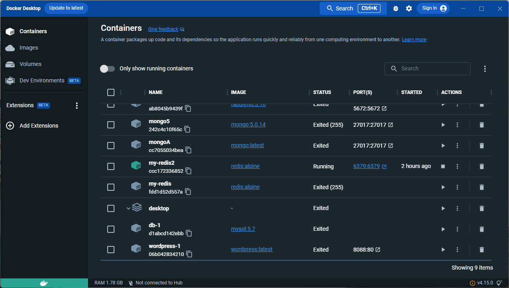
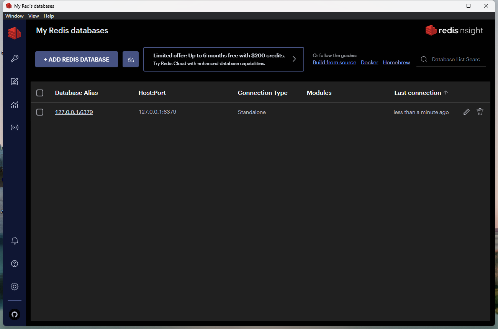
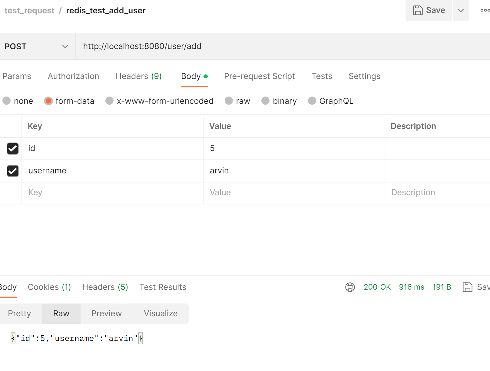
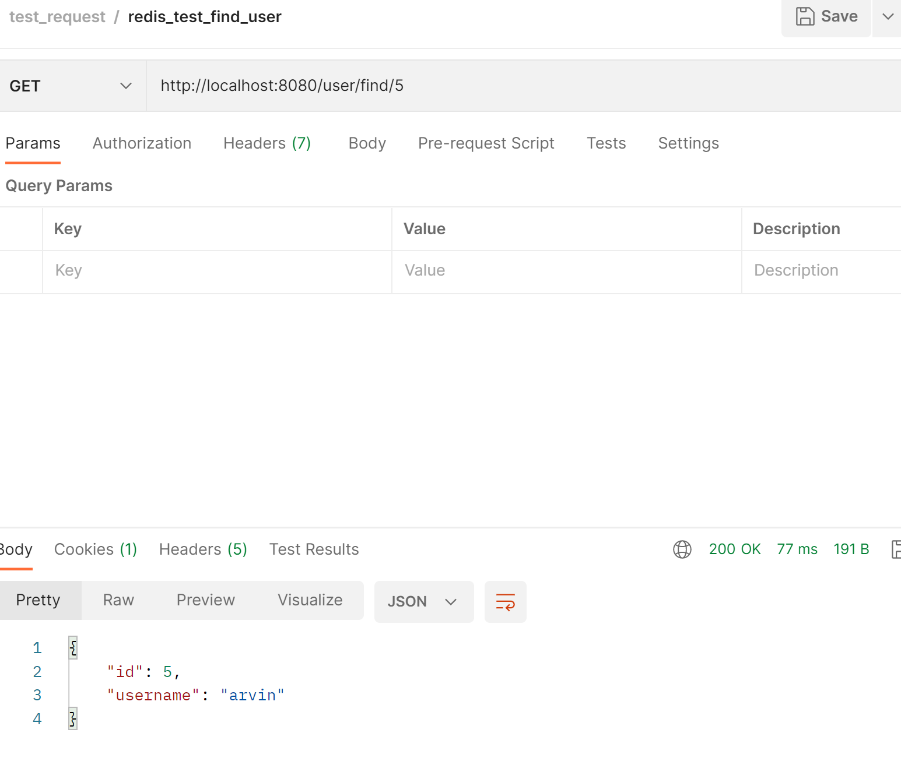
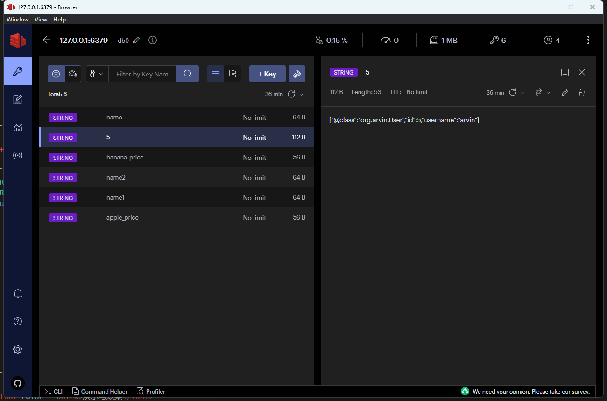
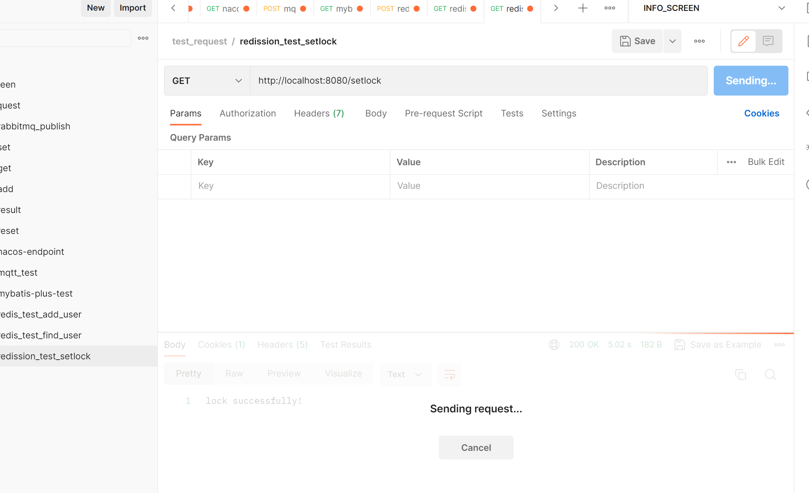
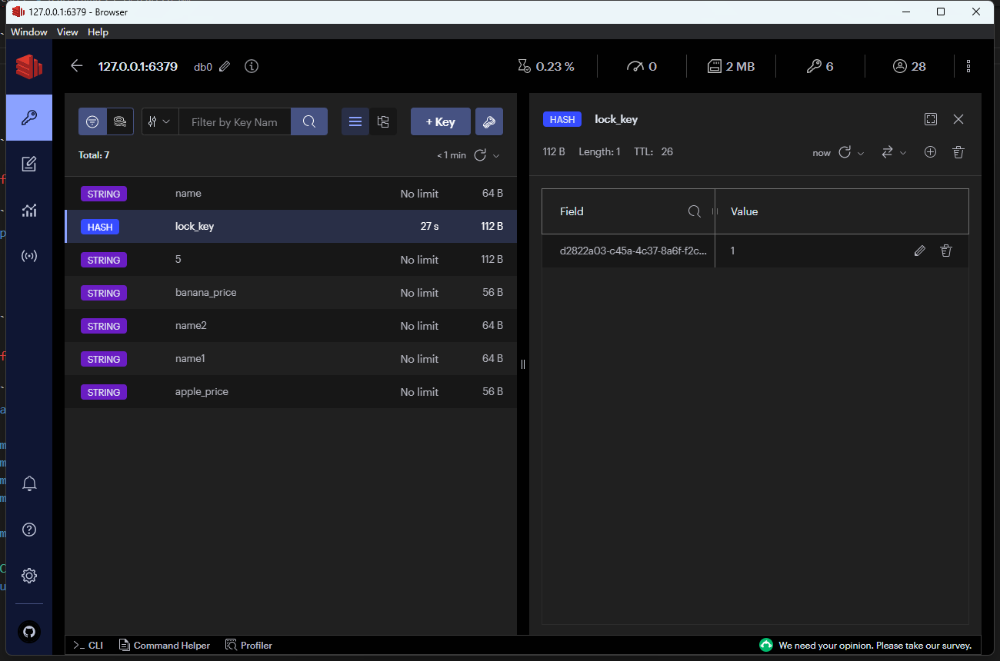

# redis 入门篇

<font size = 6 color = gray>参考：https://redis.io/</font>

<h2>1、概括</h2>

<font size = 6 color = gray>参考：https://redis.io/docs/about/</font>

>redis官方解释摘录1：Redis是一款开源的基于内存数据存储，常用于数据库、缓存、消息代理、流媒体引擎。提供了strings、hashes、lists、sets、sorted sets、bitmaps、hyperloglogs、geospatial indexes 和streams这些数据结构，内置了relication、Lua scripting、LRU eviction、transactions和不同级别的基于磁盘的持久化等功能，并通过Redis Sentinel 和 Redis Cluster的自动分区提供了高可用性。

>redis官方解释摘录2：我们可以执行原子操作再这些类型，如添加一个string类型；新增一个值再hash类型；计算set类型的并集、交集和差集；获取有序集合中的最高成员。

>redis官方解释摘录3：为了实现高性能，Redis工作于基于内存的数据集。Redis通过定期将数据集转储到磁盘或将每个命令附加到基于内存的日志中实现持久化。如果仅仅需要功能丰富的、联网的缓存，也是可以禁用持久化功能的。

>redis官方解释摘录4：Redis支持异步复制，具有快速的非阻塞同步和部分重新同步重连。

>Redis也包括:事务、发布/订阅、Lua脚本、具有过期时间的key、LRU eviction of keys、Automatic failover

>Redis是由C语言开发的，推荐再Linux上部署

<h2>2、应用</h2>

<h3>2.1、windows上使用安装Redis</h3>


<h3>2.2、可视化-RedisInsight</h3>

>RedisInsight是一款官方推出的可视化功能，允许用户在客户端进行基于GUI和CLI的交互。个人认为，无论是对学习或实际生产来说，它都是一款非常好的工具。<br>更多功能介绍与下载地址：https://redis.io/docs/ui/insight/



<h3>2.3、springboot集成</h3>
 
<h4>2.3.1、集成Lettuce客户端</h4>
 
<font color = balck>依赖</font>

```xml
        <dependency>
            <groupId>org.springframework.boot</groupId>
            <artifactId>spring-boot-starter-data-redis</artifactId>
        </dependency>
        <dependency>
            <groupId>org.apache.commons</groupId>
            <artifactId>commons-pool2</artifactId>
        </dependency>
```

<font color = balck>配置</font>
```yml
spring:
  redis:
    database: 0
    host: 127.0.0.1
    port: 6379
    password: test
    lettuce:
      pool:
        min-idle: 0
        max-active: 8
        max-idle: 8
        max-wait: -1ms
    connect-timeout: 30000ms
```

<font color = balck>配置类注入RedisTemplate</font>

```java
@Configuration
public class RedisConfig {

    @Bean
    public RedisTemplate<String,Object> redisTemplate(RedisConnectionFactory factory){
        RedisTemplate<String,Object> redisTemplate = new RedisTemplate<>();
        redisTemplate.setConnectionFactory(factory);
        redisTemplate.setKeySerializer(new StringRedisSerializer());
        redisTemplate.setHashKeySerializer(new StringRedisSerializer());
        redisTemplate.setValueSerializer(new GenericJackson2JsonRedisSerializer());
        redisTemplate.setHashValueSerializer(new GenericJackson2JsonRedisSerializer());
        redisTemplate.afterPropertiesSet();
        return redisTemplate;
    }
}
```

<font color = balck>RedisTemplate使用方式</font>

```java
@RestController
@RequestMapping("/user")
public class UserController {
    @Resource
    private RedisTemplate<String,User> redisTemplate;


    @PostMapping("add")
    public User add(  User user){
        redisTemplate.opsForValue().set(String.valueOf(user.getId()),user);
        return user;
    }

    @GetMapping("find/{userId}")
    public User get(@PathVariable("userId") String userId){
        return redisTemplate.opsForValue().get(userId);
    }
}
```

<font color = balck>演示与效果</font>

<font size = 6 color = gray>add user</font>

<font size = 6 color = gray>find user</font>

<font size = 6 color = gray>redis_insight</font>


<h4>2.3.2、集成Jredis客户端</h4>

<font color = balck>依赖</font>

```xml
<dependency>
    <groupId>org.springframework.boot</groupId>
    <artifactId>spring-boot-starter-data-redis</artifactId>
    <exclusions>
        <exclusion>
            <artifactId>lettuce-core</artifactId>
            <groupId>io.lettuce</groupId>
        </exclusion>
    </exclusions>
</dependency>
<dependency>
    <groupId>redis.clients</groupId>
    <artifactId>jedis</artifactId>
</dependency>
<dependency>
    <groupId>org.apache.commons</groupId>
    <artifactId>commons-pool2</artifactId>
    <version>2.9.0</version>
</dependency>
```

<font color = balck>配置</font>

```yml
spring:
  redis:
    database: 0
    host: 127.0.0.1
    port: 6379
    password: 
    jedis:
      pool:
        min-idle: 0
        max-active: 8
        max-idle: 8
        max-wait: -1ms
    connect-timeout: 30000ms
```

<font color = balck>其他同上</font>

<font color = balck>封装工具类，略</font>

<h4>2.3.2、集成Redisson客户端</h4>

  
<font color = balck>依赖</font>

```xml
        <dependency>
            <groupId>org.redisson</groupId>
            <artifactId>redisson-spring-boot-starter</artifactId>
            <version>3.17.4</version>
        </dependency>
```

<font color = balck>配置</font>

```yml
spring:
  redis:
    database: 0
    host: 127.0.0.1
    port: 6379
```

<font color = balck>RedissionUtil</font>

```java
package org.arvin;

import org.redisson.api.RLock;
import org.redisson.api.RedissonClient;
import org.springframework.beans.factory.annotation.Autowired;
import org.springframework.stereotype.Component;

import java.util.concurrent.TimeUnit;

@Component
public class RedissonUtil {

    @Autowired
    private RedissonClient redissonClient;

    /**
     * 加锁
     */
    public RLock lock(String lockKey){
        RLock lock = redissonClient.getLock(lockKey);
        lock.lock();
        return lock;
    }

    /**
     * 带超时的锁
     * @param lockKey
     * @param timeout
     * @return
     */

    public RLock lock(String lockKey,int timeout){
        RLock lock = redissonClient.getLock(lockKey);
        lock.lock(timeout, TimeUnit.SECONDS);
        return lock;
    }

    /**
     * 带超时的锁
     * @param lockKey
     * @param unit
     * @param timeout
     * @return
     */
    public RLock lock(String lockKey,TimeUnit unit,int timeout){
        RLock lock = redissonClient.getLock(lockKey);
        lock.lock(timeout,unit);
        return lock;
    }

    /**
     * 尝试获取锁
     * @param lockKey
     * @param waitTime
     * @param leaseTime
     * @return
     */
    public boolean tryLock(String lockKey,int waitTime,int leaseTime){
        RLock lock = redissonClient.getLock(lockKey);
        try{
            return  lock.tryLock(waitTime,leaseTime,TimeUnit.SECONDS);
        }catch (InterruptedException e){
            return false;
        }
    }

    /**
     * 释放锁
     * @param lockKey
     */
    public void unlock(String lockKey){
        RLock lock = redissonClient.getLock(lockKey);
        lock.unlock();
    }

    /**
     * 释放锁
     * @param lock
     */
    public void unlock(RLock lock){
        lock.unlock();
    }

}

```

<font color = balck>测试设置锁</font>

```java
package org.arvin;

import org.springframework.beans.factory.annotation.Autowired;
import org.springframework.web.bind.annotation.GetMapping;
import org.springframework.web.bind.annotation.RestController;

@RestController
public class RedisController {

    @Autowired
    RedissonUtil redissonUtil;

    @GetMapping("setlock")
    public String setLock(){
        redissonUtil.lock("lock_key");
        try{
            Thread.currentThread().sleep(5000);
        } catch (InterruptedException e) {
            e.printStackTrace();
            //throw new RuntimeException(e);
        }
        redissonUtil.unlock("lock_key");
        return "lock successfully!";
    }
}
```

<font color = balck>演示效果</font>




<h3>2.4、Java系列常用Redis客户端</h3>

>常用的三款客户端为Jedis、lettuce、Redisson。<br>更多客户端参考：https://redis.io/resources/clients/#java
