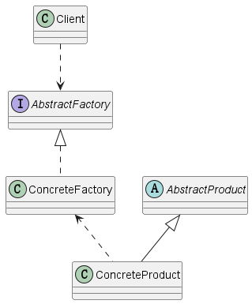
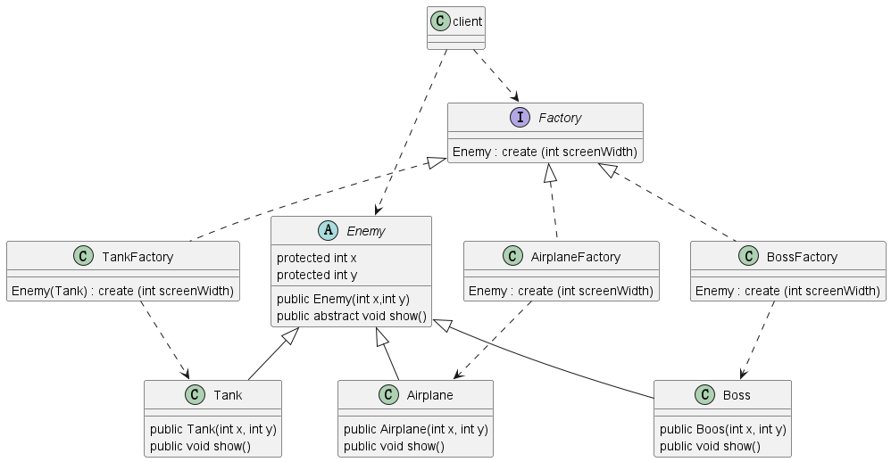
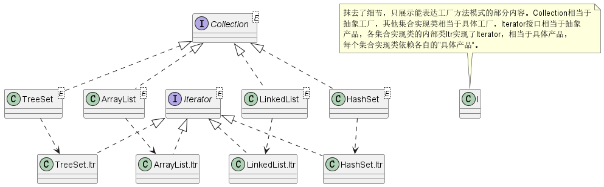

# 设计模式之工厂方法

<h3>1、背景</h3>

>在需要创建一系列同体系不同产品的场景下，工厂方法模式是非常合适的。

<h3>2、定义</h3>

>维基中定义如下，工厂方法模式（英语：Factory method pattern）是一种实现了“工厂”概念的面向对象设计模式。就像其他创建型模式一样，它也是处理在不指定对象具体类型的情况下创建对象的问题。工厂方法模式的实质是“定义一个创建对象的接口，但让实现这个接口的类来决定实例化哪个类。工厂方法让类的实例化推迟到子类中进行。”

>工厂：在面向对象程序设计中，工厂通常是一个用来创建其他对象的对象。工厂是构造方法的抽象，用来实现不同的分配方案。几个不同的设计模式都应用了工厂的概念，并可以使用在很多语言中。例如，在《设计模式》一书中，像工厂方法模式、抽象工厂模式、生成器模式，甚至是单例模式都应用了工厂的概念。

<h3>3、结构</h3>

>此模式角色有抽象产品、具体产品、抽象工厂、具体工厂;具体的产品依赖于某具体的工厂类，就是说具体产品由具体工厂创建；符合开闭原则，每当引入新的产品只需新增新的具体工厂即可。下图一点纰漏，具体工厂应该是依赖具体产品的，这里的箭头反了。



<h3>4、实例</h3>

>现在有一个飞行射击类的需求，需要在屏幕上生成坦克、飞机、Boss等角色。

>以上用例结构图如下：



>部分代码如下，详细代码：https://github.com/WRJcode/md-design-pattern/tree/master/factory-method<br>

```java
package org.arvinw.example4_4;
import org.arvinw.example4_3.Enemy;

/**
 * 抽象工厂
 */
public interface Factory {
    Enemy create (int screenWidth);
}
```

```java
/**
 * 抽象产品
 */
public abstract class Enemy {

    protected int x;
    protected int y;

    public Enemy(int x,int y){
        this.x = x;
        this.y = y;
    }
    public abstract void show();
}
```

```java
/**
 * 具体工厂
 */
public class BossFactory implements Factory{
    @Override
    public Enemy create(int screenWidth) {
        return new Boss(screenWidth/2,0);
    }
}
```

```java
import org.arvinw.example4_3.Enemy;
/**
 * 具体产品
 */
public class Boss extends Enemy {
    public Boss(int x, int y) {
        super(x, y);
    }

    @Override
    public void show() {
        System.out.println("Boss出现的位置");
        System.out.println("攻击玩家的boss");
    }
}
```

```java
/**
 * 使用工厂方法设计模式
 */
public class Client {
    public static void main(String[] args) {
        int screenWidth = 100;
        System.out.println("游戏开始");

        Factory factory = new TankFactory();
        for (int i=0;i<5;i++){
            factory.create(screenWidth).show();
        }

        factory = new AirplaneFactory();
        for (int i=0;i<10;i++){
            factory.create(screenWidth).show();
        }

        System.out.println("抵达关底");
        factory = new BossFactory();
        factory.create(screenWidth).show();
    }
}
```

<h3>5、其他框架实例</h3>

>JDK-Collection中的方法工厂：<br>抽象工厂:Collection<br>具体工厂：ArrayList、LinkedList、HashSet、TreeSet<br>抽象产品：Iterator<br>具体产品：定义在各个具体工厂的Itr，实现了Iterator.

>演示如下

```java
        Collection<Integer> list = new ArrayList<>();
        list.add(1);
        list.add(5);
        list.add(7);
        Iterator<Integer> itr = list.iterator();
        while (itr.hasNext()){
            System.out.println(itr.next());
        }

        list = new LinkedList<>();
        list.add(1);
        list.add(7);
        list.add(9);
        itr = list.iterator();
        while (itr.hasNext()){
            System.out.println(itr.next());
        }

        Collection<Integer> set = new HashSet<>();
        set.add(1);
        set.add(5);
        set.add(5);
        set.add(8);
        itr = set.iterator();
        while (itr.hasNext()){
            System.out.println(itr.next());
        }

        set = new TreeSet<>();
        set.add(1);
        set.add(5);
        set.add(5);
        set.add(8);
        itr = set.iterator();
        while (itr.hasNext()){
            System.out.println(itr.next());
        }
```

