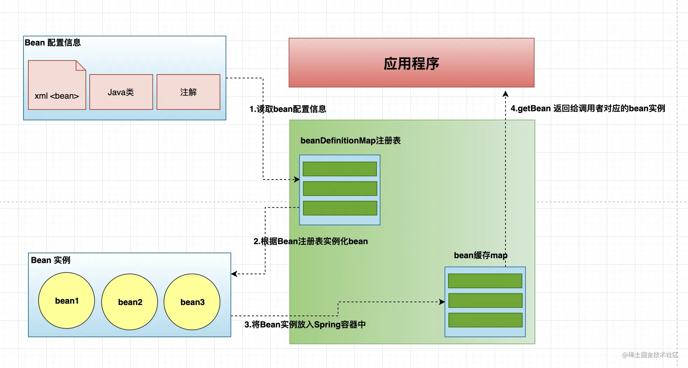

# Spring Core入门

<font size = 6 color = gray>参考：https://docs.spring.io/spring-framework/docs/current/reference/html/core.html#beans</font>

<h2>1、Ioc Container</h2>



>官方解释:The org.springframework.context.ApplicationContext是Spring Ioc容器的抽象，负责Bean的实例化、配置和装配 。容器通过配置元数据获取对象实例化、配置和装配的指令。配置元数据以XML、Java注释或Java代码表示。配置元数据表达了应用的对象和对象之间的依赖关系。<br>Spring提供的Application实现类有几种，单体应用中应用的有ClassPathXmlApplicationContext和FileSystemXmlApplicationContext。实际开发中，我们经常混合使用XML配置、注解、Java代码（如配置类）代表配置元数据。

<h3>1.1、Configuration Metadata</h3>

>现在开发中常用配置元数据的两种形式：<br>1、基于注解，如@Component、@Service、@Controller、@Autowired等<br>2、基于Java的配置类：定义来自应用程序外部的Bean，相关注解 @Configuration, @Bean, @Import和@DependsOn

>基于XML配置的一个例子如下

```xml
<?xml version="1.0" encoding="UTF-8"?>
<beans xmlns="http://www.springframework.org/schema/beans"
    xmlns:xsi="http://www.w3.org/2001/XMLSchema-instance"
    xsi:schemaLocation="http://www.springframework.org/schema/beans
        https://www.springframework.org/schema/beans/spring-beans.xsd">

    <bean id="..." class="..."> (1) (2)
        <!-- collaborators and configuration for this bean go here -->
    </bean>
    <bean id="..." class="...">
        <!-- collaborators and configuration for this bean go here -->
    </bean>
    <!-- more bean definitions go here -->

</beans>

```

<h3>1.2、使用容器</h3>

```java
// create and configure beans
ApplicationContext context = new ClassPathXmlApplicationContext("services.xml", "daos.xml");

// retrieve configured instance
PetStoreService service = context.getBean("petStore", PetStoreService.class);

// use configured instance
List<String> userList = service.getUsernameList();


```

>The most flexible variant is GenericApplicationContext in combination with reader delegates — for example, with XmlBeanDefinitionReader for XML files, as the following example shows:
```java
GenericApplicationContext context = new GenericApplicationContext();
new XmlBeanDefinitionReader(context).loadBeanDefinitions("services.xml", "daos.xml");
context.refresh();
```

>实际生产中我们其实很少用到Spring Api去获取Bean，例如，Spring与web框架的集成为各种web框架组件（如控制器和JSF管理的bean）提供了依赖注入，允许您通过元数据（如自动布线注释）声明对特定bean的依赖。

<h3>1.3、BeanDefinition</h3>

>Within the container itself, these bean definitions are represented as BeanDefinition objects

<font size  = 5 color = gray>Table 1. The bean definition</font>

|Property	|Explained in…​|
| --------- | --------------- |
|Class    |Instantiating Beans|
|Name    |Naming Beans|
|Scope  |Bean Scopes|
|Constructor arguments |Dependency Injection|
|Properties  |Dependency Injection|
|Autowiring mode| Autowiring Collaborators|
|Lazy initialization mode |Lazy-initialized Beans|
|Initialization method   |Initialization Callbacks|
|Destruction method  |Destruction Callbacks|

>In addition to bean definitions that contain information on how to create a specific bean, the ApplicationContext implementations also permit the registration of existing objects that are created outside the container (by users). This is done by accessing the ApplicationContext’s BeanFactory through the getBeanFactory() method, which returns the DefaultListableBeanFactory implementation. DefaultListableBeanFactory supports this registration through the registerSingleton(..) and registerBeanDefinition(..) methods. However, typical applications work solely with beans defined through regular bean definition metadata.

>机翻 ：除了包含关于如何创建特定bean的信息的bean定义之外，ApplicationContext实现还允许注册（由用户）在容器外部创建的现有对象。这是通过getBeanFactory（）方法访问ApplicationContext的BeanFactory来完成的，该方法返回DefaultListableBeanFactory实现。DefaultListableBeanFactory通过registerSingleton（..）和registerBeanDefinition（..）方法支持此注册。然而，典型的应用程序只使用通过常规bean定义元数据定义的bean。

>有一些场景可能需要我们再程序运行期间注入Bean或者修改Bean的BeanDefinition，然后利用Ioc容器进行统一管理。而按照以上所说的方法可以实现这一需求。以下是一些例子

<h4>Dynamic Bean Registration With GenericBeanDefinition</h4>

<font size = 7 color = balck>Creating Example Bean class</font>

```java
public class MyBean {
  private Date date;
  public void doSomething () {
      System.out.println("from my bean, date: " + date);
  }
  public void setDate (Date date) {
      this.date = date;
  }
}
```

<font size = 7 color = balck>Registering the above, created bean dynamically using GenericBeanDefinition.</font>

```java
public class GenericBeanDefinitionExample {
  public static void main (String[] args) {
      DefaultListableBeanFactory context =
                new DefaultListableBeanFactory();
      GenericBeanDefinition gbd = new GenericBeanDefinition();
      gbd.setBeanClass(MyBean.class);
      MutablePropertyValues mpv = new MutablePropertyValues();
      mpv.add("date", new Date());
      //alternatively we can use:
      // gbd.getPropertyValues().addPropertyValue("date", new Date());
      gbd.setPropertyValues(mpv);
      context.registerBeanDefinition("myBeanName", gbd);
      MyBean bean = context.getBean(MyBean.class);
      bean.doSomething();
  }
}
```

<font size = 7 color = balck>Output</font>

```console
from my bean, date: Wed Jult 23 12:20:58 EDT 2019
```

<h4>Dynamic Bean Registration With BeanDefinitionBuilder</h4>

<font size = 7 color = balck>Creating another bean class</font>

```java
public class MyBean {
  private String str;
  public void setStr (String str) {
      this.str = str;
  }
  public void doSomething () {
      System.out.println("from MyBean " + str);
  }
}
```

<font size = 7 color = balck>Example to register the bean dynamically using BeanDefinitionBuilder.</font>

```java
public class BeanDefinitionBuilderExample {
  public static void main (String[] args) {
      DefaultListableBeanFactory beanFactory =
                new DefaultListableBeanFactory();
      BeanDefinitionBuilder b =
                BeanDefinitionBuilder.rootBeanDefinition(MyBean.class)
                                     .addPropertyValue("str", "myStringValue");
      beanFactory.registerBeanDefinition("myBean", b.getBeanDefinition());
      MyBean bean = beanFactory.getBean(MyBean.class);
      bean.doSomething();
  }
}
```

<font size = 7 color = balck>Output</font>

```console
from MyBean myStringValue
```

<h4>Injecting other bean references using BeanDefinitionBuilder</h4>

<font size = 7 color = balck>Creating Bean 1</font>

```java
public class Bean1 {
  private Bean2 otherBean;
  public void setOtherBean (Bean2 otherBean) {
      this.otherBean = otherBean;
  }
  public void doSomething () {
      otherBean.doSomething();
  }
}
```


<font size = 7 color = balck>Creating Bean 2</font>

```java
public class Bean2 {
  public void doSomething () {
      System.out.println("from other bean ");
  }
}
```

<font size = 7 color = balck>Seting the Bean2 in Bean1</font>

```java
public class InjectingOtherBeans {
  public static void main (String[] args) {
      DefaultListableBeanFactory context =
                new DefaultListableBeanFactory();
      //define and register MyOtherBean
      GenericBeanDefinition beanOtherDef = new GenericBeanDefinition();
      beanOtherDef.setBeanClass(Bean2.class);
      context.registerBeanDefinition("other", beanOtherDef);
      //definine and register myBean
      GenericBeanDefinition beanDef = new GenericBeanDefinition();
      beanDef.setBeanClass(Bean1.class);
      MutablePropertyValues mpv = new MutablePropertyValues();
      mpv.addPropertyValue("otherBean", context.getBean("other"));
      beanDef.setPropertyValues(mpv);
      context.registerBeanDefinition("myBean", beanDef);
      //using MyBean instance
      MyBean bean = context.getBean(MyBean.class);
      bean.doSomething();
  }
}
```

<font size = 7 color = balck>Output</font>

```console
from other bean
```

<h4> Dynamic Bean Registration With BeanFactoryPostProcessor</h4>

<font size = 7 color = balck>Creating config</font>

```java
@Configuration
public class MyConfig {
  @Bean
  MyConfigBean myConfigBean () {
      return new MyConfigBean();
  }
}
```

```java
public class MyConfigBean implements BeanFactoryPostProcessor {
  @Override
  public void postProcessBeanFactory (
            ConfigurableListableBeanFactory beanFactory)
            throws BeansException {
      GenericBeanDefinition bd = new GenericBeanDefinition();
      bd.setBeanClass(MyBean.class);
      bd.getPropertyValues().add("strProp", "my string property");
      ((DefaultListableBeanFactory) beanFactory)
                .registerBeanDefinition("myBeanName", bd);
  }
}
```

<font size = 7 color = balck>Creating another Bean for Demo</font>

```java
public class MyBean {
  private String strProp;
  public void setStrProp (String strProp) {
      this.strProp = strProp;
  }
  public void doSomething () {
      System.out.println("from MyBean:  " + strProp);
  }
}
```

<font size = 7 color = balck>Main class for BeanFactoryPostProcessor Example.</font>

```java
public class BeanFactoryPostProcessorExample {
  public static void main (String[] args) {
      AnnotationConfigApplicationContext context =
                new AnnotationConfigApplicationContext(MyConfig.class);
      MyBean bean = context.getBean(MyBean.class);
      bean.doSomething();
  }
}
```
<font size = 7 color = balck>Output</font>

```console
from MyBean:  my string property
WARNING: @Bean method MyConfig.myConfigBean is non-static and returns an object assignable to Spring's BeanFactoryPostProcessor interface. This will result in a failure to process annotations such as @Autowired, @Resource and @PostConstruct within the method's declaring @Configuration class. Add the 'static' modifier to this method to avoid these container lifecycle issues; see @Bean javadoc for complete details.
```

<h4>Dynamic Bean Registration With BeanDefinitionRegistryPostProcessor</h4>

<font size = 7 color = balck>OuCreating another config class.tput</font>

```java
@Configuration
public class MyConfig {
  @Bean
  MyConfigBean myConfigBean () {
      return new MyConfigBean();
  }
}
```

```java
public class MyConfigBean implements BeanDefinitionRegistryPostProcessor {
  @Override
  public void postProcessBeanDefinitionRegistry (BeanDefinitionRegistry registry)
            throws BeansException {
      GenericBeanDefinition bd = new GenericBeanDefinition();
      bd.setBeanClass(MyBean.class);
      bd.getPropertyValues().add("strProp", "my string property");
      registry.registerBeanDefinition("myBeanName", bd);
  }
  @Override
  public void postProcessBeanFactory (ConfigurableListableBeanFactory beanFactory)
            throws BeansException {
      //no op
  }
}
```

<font size = 7 color = balck>Creating a brand new Bean class</font>

```java
public class MyBean {
  private String strProp;
  public void setStrProp (String strProp) {
      this.strProp = strProp;
  }
  public void doSomething () {
      System.out.println("from MyBean:  " + strProp);
  }
}
```

<font size = 7 color = balck>OutMain class for BeanDefinitionRegistryPostProcessor Example.put</font>

```java
public class BeanDefinitionRegistryPostProcessorExample {
  public static void main (String[] args) {
      AnnotationConfigApplicationContext context =
                new AnnotationConfigApplicationContext(MyConfig.class);
      MyBean bean = (MyBean) context.getBean("myBeanName");
      bean.doSomething();
  }
}
```

<font size = 7 color = balck>Output</font>

```console
from MyBean:  my string property
WARNING: Cannot enhance @Configuration bean definition 'beanDefinitionRegistryPostProcessorExample.MyConfig' since its singleton instance has been created too early. The typical cause is a non-static @Bean method with a BeanDefinitionRegistryPostProcessor return type: Consider declaring such methods as 'static'.
```

<h4>运行时卸载bean</h4>

```java
beanRegistry.removeBeanDefinition("bean")
beanRegistry.destroySingleton("bean")
```

<h4>Instantiation </h3>

*Instantiation with a Constructor*

```xml
<bean id="exampleBean" class="examples.ExampleBean"/>

<bean name="anotherExample" class="examples.ExampleBeanTwo"/>
```

*Instantiation with a Static Factory Method*

```xml
<bean id="clientService"
    class="examples.ClientService"
    factory-method="createInstance"/>
```

```java
public class ClientService {
    private static ClientService clientService = new ClientService();
    private ClientService() {}

    public static ClientService createInstance() {
        return clientService;
    }
}
```

*Instantiation by Using an Instance Factory Method*
>看文档吧

*Determining a Bean’s Runtime Type*
>看文档吧

<h3>1.4、Dependencies</h3>

>待续


