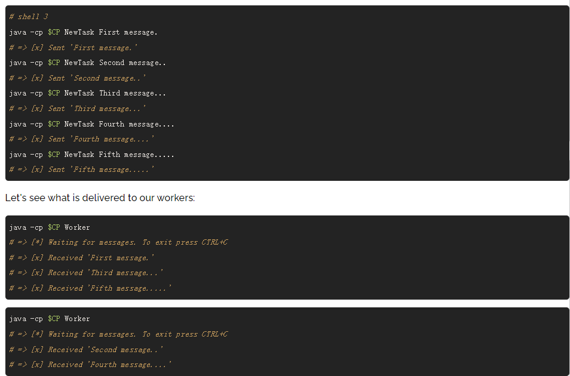

# 一篇文章入门rabbitMQ

 <font size = 5 color = gray>参考：https://www.rabbitmq.com/tutorials/tutorial-one-java.html</font>

<h2>1、官方定义与术语</h2>

<font size = 6>官方定义</font>

>RabbitMQ is a message broker: it accepts and forwards messages. You can think about it as a post office: when you put the mail that you want posting in a post box, you can be sure that the letter carrier will eventually deliver the mail to your recipient. In this analogy, RabbitMQ is a post box, a post office, and a letter carrier.

>大概意思是，RabbitMQ是一个消息代理，国内一般称之为消息队列中间件。它接收并转发消息。举个生动例子，我们可以把它看作是邮政，当我们邮递信件时，可以把信件放到邮政，邮政便帮我们转发给收信人。

<font size = 6>涉及术语</font>

>**生产者（producer）**：“发送信件”的客户端称之为生产者<br>**队列（queue）**：RabbitMQ中的“邮箱”。官方解释：尽管消息流经RabbitMQ和您的应用程序，但它们只能存储在队列中。队列只受主机的内存和磁盘限制的约束，它本质上是一个很大的消息缓冲区。许多生产者可以向一个队列发送消息，许多消费者可以尝试从一个队列接收数据。这就是我们表示队列的方式。<br>**消费者：**接收“信件”的客户端。

<h2>2、安装并开启rabbitMq</h2>

<font size = 5>因为我的电脑只有windows系统，仅演示windows安装方式。有两种方式，一个是安装客户端，但是在下载erlang环境，另一种方式相对简单，先安装docker for window，利用docker安装rabbitMq客户端。</font>

<h2>3、RabbitMQ提供的Java Client演示一个Hello World</h2>

<h3>3.1、导入jar包或从Maven仓库导入Java Client</h3>

<h3>3.2、生产者客户端</h3>

```java
import com.rabbitmq.client.Channel;
import com.rabbitmq.client.Connection;
import com.rabbitmq.client.ConnectionFactory;

import java.nio.charset.StandardCharsets;

public class Send {

    private final static String QUEUE_NAME = "hello";

    public static void main(String[] argv) throws Exception {
        ConnectionFactory factory = new ConnectionFactory();
        factory.setHost("localhost");
        try (Connection connection = factory.newConnection();
            Channel channel = connection.createChannel()) {
            channel.queueDeclare(QUEUE_NAME, false, false, false, null);
            String message = "Hello World!";
            channel.basicPublish("", QUEUE_NAME, null, message.getBytes(StandardCharsets.UTF_8));
            System.out.println(" [x] Sent '" + message + "'");
        }
    }
}
```

<h3>3.3、消费者客户端</h3>

```java
import com.rabbitmq.client.Channel;
import com.rabbitmq.client.Connection;
import com.rabbitmq.client.ConnectionFactory;
import com.rabbitmq.client.DeliverCallback;
import java.nio.charset.StandardCharsets;

public class Recv {

    private final static String QUEUE_NAME = "hello";

    public static void main(String[] argv) throws Exception {
        ConnectionFactory factory = new ConnectionFactory();
        factory.setHost("localhost");
        Connection connection = factory.newConnection();
        Channel channel = connection.createChannel();

        channel.queueDeclare(QUEUE_NAME, false, false, false, null);
        System.out.println(" [*] Waiting for messages. To exit press CTRL+C");

        DeliverCallback deliverCallback = (consumerTag, delivery) -> {
            String message = new String(delivery.getBody(), StandardCharsets.UTF_8);
            System.out.println(" [x] Received '" + message + "'");
        };
        channel.basicConsume(QUEUE_NAME, true, deliverCallback, consumerTag -> { });
    }
}
```

<h3>3.4、演示</h3>

<h2>4、多线程下的消息队列：分配耗时任务</h2>

<h3>4.1、NewTask</h2>

```java
import com.rabbitmq.client.Channel;
import com.rabbitmq.client.Connection;
import com.rabbitmq.client.ConnectionFactory;
import com.rabbitmq.client.MessageProperties;

public class NewTask {

  private static final String TASK_QUEUE_NAME = "task_queue";

  public static void main(String[] argv) throws Exception {
    ConnectionFactory factory = new ConnectionFactory();
    factory.setHost("localhost");
    try (Connection connection = factory.newConnection();
         Channel channel = connection.createChannel()) {
        channel.queueDeclare(TASK_QUEUE_NAME, true, false, false, null);

        String message = String.join(" ", argv);

        channel.basicPublish("", TASK_QUEUE_NAME,
                MessageProperties.PERSISTENT_TEXT_PLAIN,
                message.getBytes("UTF-8"));
        System.out.println(" [x] Sent '" + message + "'");
    }
  }

}
```

<h3>4.2、worker</h3>

```java
import com.rabbitmq.client.Channel;
import com.rabbitmq.client.Connection;
import com.rabbitmq.client.ConnectionFactory;
import com.rabbitmq.client.DeliverCallback;

public class Worker {

  private static final String TASK_QUEUE_NAME = "task_queue";

  public static void main(String[] argv) throws Exception {
    ConnectionFactory factory = new ConnectionFactory();
    factory.setHost("localhost");
    final Connection connection = factory.newConnection();
    final Channel channel = connection.createChannel();

    channel.queueDeclare(TASK_QUEUE_NAME, true, false, false, null);
    System.out.println(" [*] Waiting for messages. To exit press CTRL+C");

    channel.basicQos(1);

    DeliverCallback deliverCallback = (consumerTag, delivery) -> {
        String message = new String(delivery.getBody(), "UTF-8");

        System.out.println(" [x] Received '" + message + "'");
        try {
            doWork(message);
        } finally {
            System.out.println(" [x] Done");
            channel.basicAck(delivery.getEnvelope().getDeliveryTag(), false);
        }
    };
    channel.basicConsume(TASK_QUEUE_NAME, false, deliverCallback, consumerTag -> { });
  }

  private static void doWork(String task) {
    for (char ch : task.toCharArray()) {
        if (ch == '.') {
            try {
                Thread.sleep(1000);
            } catch (InterruptedException _ignored) {
                Thread.currentThread().interrupt();
            }
        }
    }
  }
}
```

<h3>4.3、演示</h3>



<h2>5、Publish/Subscribe</h2>

<h3>5.1、一些术语</h3>

> **publish/subscribe**:发布订阅模式，这种模式可以将发布者的一条信息传递给多个订阅者。
> **Exchanges**:交换机。下面看一段官方订阅

>The core idea in the messaging model in RabbitMQ is that the producer never sends any messages directly to a queue. Actually, quite often the producer doesn't even know if a message will be delivered to any queue at all.<br>Instead, the producer can only send messages to an exchange. An exchange is a very simple thing. On one side it receives messages from producers and the other side it pushes them to queues. The exchange must know exactly what to do with a message it receives. Should it be appended to a particular queue? Should it be appended to many queues? Or should it get discarded. The rules for that are defined by the exchange type.

>RabbitMQ中消息传递模型的核心思想是，生产者从不直接向队列发送任何消息。实际上，通常情况下，生产者甚至不知道消息是否会被传递到任何队列。<br>相反，**生产者只能向交易所发送消息**。交换是一件非常简单的事情。它一方面接收来自生产者的消息，另一方面将消息推送到队列。交易所必须确切地知道如何处理收到的消息。是否应将其附加到特定队列？是否应该将其附加到许多队列中？或者应该丢弃它。其规则由交换类型定义。


<h3>5.2、交换类型</h3>

* **direct**
* **topic**
* **headers**
* **fanout**

<h3>5.3、EmitLog</h3>

```java
public class EmitLog {

  private static final String EXCHANGE_NAME = "logs";

  public static void main(String[] argv) throws Exception {
    ConnectionFactory factory = new ConnectionFactory();
    factory.setHost("localhost");
    try (Connection connection = factory.newConnection();
         Channel channel = connection.createChannel()) {
        channel.exchangeDeclare(EXCHANGE_NAME, "fanout");

        String message = argv.length < 1 ? "info: Hello World!" :
                            String.join(" ", argv);

        channel.basicPublish(EXCHANGE_NAME, "", null, message.getBytes("UTF-8"));
        System.out.println(" [x] Sent '" + message + "'");
    }
  }
}
```

<h3>5.4、ReceiveLogs</h3>

```java
import com.rabbitmq.client.Channel;
import com.rabbitmq.client.Connection;
import com.rabbitmq.client.ConnectionFactory;
import com.rabbitmq.client.DeliverCallback;

public class ReceiveLogs {
  private static final String EXCHANGE_NAME = "logs";

  public static void main(String[] argv) throws Exception {
    ConnectionFactory factory = new ConnectionFactory();
    factory.setHost("localhost");
    Connection connection = factory.newConnection();
    Channel channel = connection.createChannel();

    channel.exchangeDeclare(EXCHANGE_NAME, "fanout");
    String queueName = channel.queueDeclare().getQueue();
    channel.queueBind(queueName, EXCHANGE_NAME, "");

    System.out.println(" [*] Waiting for messages. To exit press CTRL+C");

    DeliverCallback deliverCallback = (consumerTag, delivery) -> {
        String message = new String(delivery.getBody(), "UTF-8");
        System.out.println(" [x] Received '" + message + "'");
    };
    channel.basicConsume(queueName, true, deliverCallback, consumerTag -> { });
  }
}
```

<h3>5.5、效果演示</h3>


<h2>6、Routing</h2>

<h3>6.1、一些术语</h3>

>**Routing**:路由，可以使得消费者只订阅信息的子集。<br>**Bindings**:exchange（交换机）与queue绑定，可以携带一个routingKey参数。binging key的意义依赖于交换机的类型，当为fanout类型时，通产忽略它的意义。
```java
  //绑定queue与exchange
  channel.queueBind(queueName, EXCHANGE_NAME, "");
  channel.queueBind(queueName, EXCHANGE_NAME, "black");

```

>**direct exchange**:携带routing key的消息匹配队列的binding key，一致才进入该队列。


<h3>6.2、EmitLogDirect</h3>

```java
import com.rabbitmq.client.Channel;
import com.rabbitmq.client.Connection;
import com.rabbitmq.client.ConnectionFactory;

public class EmitLogDirect {

  private static final String EXCHANGE_NAME = "direct_logs";

  public static void main(String[] argv) throws Exception {
    ConnectionFactory factory = new ConnectionFactory();
    factory.setHost("localhost");
    try (Connection connection = factory.newConnection();
         Channel channel = connection.createChannel()) {
        channel.exchangeDeclare(EXCHANGE_NAME, "direct");

        String severity = getSeverity(argv);
        String message = getMessage(argv);

        channel.basicPublish(EXCHANGE_NAME, severity, null, message.getBytes("UTF-8"));
        System.out.println(" [x] Sent '" + severity + "':'" + message + "'");
    }
  }
  //..
}
```

<h3>6.3ReceiveLogsDirect</h3>

```java
import com.rabbitmq.client.*;

public class ReceiveLogsDirect {

  private static final String EXCHANGE_NAME = "direct_logs";

  public static void main(String[] argv) throws Exception {
    ConnectionFactory factory = new ConnectionFactory();
    factory.setHost("localhost");
    Connection connection = factory.newConnection();
    Channel channel = connection.createChannel();

    channel.exchangeDeclare(EXCHANGE_NAME, "direct");
    String queueName = channel.queueDeclare().getQueue();

    if (argv.length < 1) {
        System.err.println("Usage: ReceiveLogsDirect [info] [warning] [error]");
        System.exit(1);
    }

    for (String severity : argv) {
        channel.queueBind(queueName, EXCHANGE_NAME, severity);
    }
    System.out.println(" [*] Waiting for messages. To exit press CTRL+C");

    DeliverCallback deliverCallback = (consumerTag, delivery) -> {
        String message = new String(delivery.getBody(), "UTF-8");
        System.out.println(" [x] Received '" +
            delivery.getEnvelope().getRoutingKey() + "':'" + message + "'");
    };
    channel.basicConsume(queueName, true, deliverCallback, consumerTag -> { });
  }
}
```

<h3>6.4、演示</h3>

<h2>7、Topics</h2>

<h3>7.1、direct类型交互器局限与topic类型</h3>

>direct类型的交换器虽然可以通过绑定key路由到具体消费者监听的队列。但也有其局限，**不能基于多标准进行路由**。假如消费者不仅要求错误级别也要求错误来源，那么之前的direct类型交换器便难以实现。而topic类型的交换器可以。<br>**Topic exchange**:发送到主题交换的消息不能有任意的routing_key，它必须是由句点分隔的单词列表。单词可以是任何东西，但通常它们指定与消息相关的一些功能。一些有效的路由密钥示例：“stock.usd.nyse”、“nyse.vmw”、“quickOrange.rabbbit”。路由密钥中可以有任意多个单词，最多255个字节。

>绑定密钥也必须采用相同的形式。主题交换背后的逻辑类似于直接逻辑-使用特定路由密钥发送的消息将被传递到使用匹配绑定密钥绑定的所有队列。但是，绑定密钥有两种重要的特殊情况：

* ***(star) can substitute for exactly one word.**
* **# (hash) can substitute for zero or more words.**

<h3>7.2、EmitLogTopic </h3>

```java
import com.rabbitmq.client.Channel;
import com.rabbitmq.client.Connection;
import com.rabbitmq.client.ConnectionFactory;

public class EmitLogTopic {

  private static final String EXCHANGE_NAME = "topic_logs";

  public static void main(String[] argv) throws Exception {
    ConnectionFactory factory = new ConnectionFactory();
    factory.setHost("localhost");
    try (Connection connection = factory.newConnection();
         Channel channel = connection.createChannel()) {

        channel.exchangeDeclare(EXCHANGE_NAME, "topic");

        String routingKey = getRouting(argv);
        String message = getMessage(argv);

        channel.basicPublish(EXCHANGE_NAME, routingKey, null, message.getBytes("UTF-8"));
        System.out.println(" [x] Sent '" + routingKey + "':'" + message + "'");
    }
  }
  //..
}
```

<h3>7.3、ReceiveLogsTopic </h3>

```java
import com.rabbitmq.client.Channel;
import com.rabbitmq.client.Connection;
import com.rabbitmq.client.ConnectionFactory;
import com.rabbitmq.client.DeliverCallback;

public class ReceiveLogsTopic {

  private static final String EXCHANGE_NAME = "topic_logs";

  public static void main(String[] argv) throws Exception {
    ConnectionFactory factory = new ConnectionFactory();
    factory.setHost("localhost");
    Connection connection = factory.newConnection();
    Channel channel = connection.createChannel();

    channel.exchangeDeclare(EXCHANGE_NAME, "topic");
    String queueName = channel.queueDeclare().getQueue();

    if (argv.length < 1) {
        System.err.println("Usage: ReceiveLogsTopic [binding_key]...");
        System.exit(1);
    }

    for (String bindingKey : argv) {
        channel.queueBind(queueName, EXCHANGE_NAME, bindingKey);
    }

    System.out.println(" [*] Waiting for messages. To exit press CTRL+C");

    DeliverCallback deliverCallback = (consumerTag, delivery) -> {
        String message = new String(delivery.getBody(), "UTF-8");
        System.out.println(" [x] Received '" +
            delivery.getEnvelope().getRoutingKey() + "':'" + message + "'");
    };
    channel.basicConsume(queueName, true, deliverCallback, consumerTag -> { });
  }
}
```

<h3>7.4、使用与演示</h3>

```java
//To compile:
javac -cp $CP ReceiveLogsTopic.java EmitLogTopic.java
//To receive all the logs:
java -cp $CP ReceiveLogsTopic "#"
//To receive all logs from the facility "kern":
java -cp $CP ReceiveLogsTopic "kern.*"
//Or if you want to hear only about "critical" logs:
java -cp $CP ReceiveLogsTopic "*.critical"
//You can create multiple bindings:
java -cp $CP ReceiveLogsTopic "kern.*" "*.critical"
//And to emit a log with a routing key "kern.critical" type:
java -cp $CP EmitLogTopic "kern.critical" "A critical kernel error"
```

<h2>8、Remote procedure call (RPC)</h2>

<h3>8.1、背景</h3>

>In the second tutorial we learned how to use Work Queues to distribute time-consuming tasks among multiple workers.<br>But what if we need to run a function on a remote computer and wait for the result? Well, that's a different story. This pattern is commonly known as Remote Procedure Call or RPC.

<h3>8.2、RPCClient</h3>

```java
import com.rabbitmq.client.AMQP;
import com.rabbitmq.client.Channel;
import com.rabbitmq.client.Connection;
import com.rabbitmq.client.ConnectionFactory;

import java.io.IOException;
import java.util.UUID;
import java.util.concurrent.*;

public class RPCClient implements AutoCloseable {

    private Connection connection;
    private Channel channel;
    private String requestQueueName = "rpc_queue";

    public RPCClient() throws IOException, TimeoutException {
        ConnectionFactory factory = new ConnectionFactory();
        factory.setHost("localhost");

        connection = factory.newConnection();
        channel = connection.createChannel();
    }

    public static void main(String[] argv) {
        try (RPCClient fibonacciRpc = new RPCClient()) {
            for (int i = 0; i < 32; i++) {
                String i_str = Integer.toString(i);
                System.out.println(" [x] Requesting fib(" + i_str + ")");
                String response = fibonacciRpc.call(i_str);
                System.out.println(" [.] Got '" + response + "'");
            }
        } catch (IOException | TimeoutException | InterruptedException | ExecutionException e) {
            e.printStackTrace();
        }
    }

    public String call(String message) throws IOException, InterruptedException, ExecutionException {
        final String corrId = UUID.randomUUID().toString();

        String replyQueueName = channel.queueDeclare().getQueue();
        AMQP.BasicProperties props = new AMQP.BasicProperties
                .Builder()
                .correlationId(corrId)
                .replyTo(replyQueueName)
                .build();

        channel.basicPublish("", requestQueueName, props, message.getBytes("UTF-8"));

        final CompletableFuture<String> response = new CompletableFuture<>();

        String ctag = channel.basicConsume(replyQueueName, true, (consumerTag, delivery) -> {
            if (delivery.getProperties().getCorrelationId().equals(corrId)) {
                response.complete(new String(delivery.getBody(), "UTF-8"));
            }
        }, consumerTag -> {
        });

        String result = response.get();
        channel.basicCancel(ctag);
        return result;
    }

    public void close() throws IOException {
        connection.close();
    }
}

```

<h3>8.3、RPCServer</h3>

```java
import com.rabbitmq.client.*;

public class RPCServer {

    private static final String RPC_QUEUE_NAME = "rpc_queue";

    private static int fib(int n) {
        if (n == 0) return 0;
        if (n == 1) return 1;
        return fib(n - 1) + fib(n - 2);
    }

    public static void main(String[] argv) throws Exception {
        ConnectionFactory factory = new ConnectionFactory();
        factory.setHost("localhost");

        Connection connection = factory.newConnection();
        Channel channel = connection.createChannel();
        channel.queueDeclare(RPC_QUEUE_NAME, false, false, false, null);
        channel.queuePurge(RPC_QUEUE_NAME);

        channel.basicQos(1);

        System.out.println(" [x] Awaiting RPC requests");

        DeliverCallback deliverCallback = (consumerTag, delivery) -> {
            AMQP.BasicProperties replyProps = new AMQP.BasicProperties
                    .Builder()
                    .correlationId(delivery.getProperties().getCorrelationId())
                    .build();

            String response = "";
            try {
                String message = new String(delivery.getBody(), "UTF-8");
                int n = Integer.parseInt(message);

                System.out.println(" [.] fib(" + message + ")");
                response += fib(n);
            } catch (RuntimeException e) {
                System.out.println(" [.] " + e);
            } finally {
                channel.basicPublish("", delivery.getProperties().getReplyTo(), replyProps, response.getBytes("UTF-8"));
                channel.basicAck(delivery.getEnvelope().getDeliveryTag(), false);
            }
        };

        channel.basicConsume(RPC_QUEUE_NAME, false, deliverCallback, (consumerTag -> {}));
    }
}
```

<h3>9、Publisher Confirms</h3>