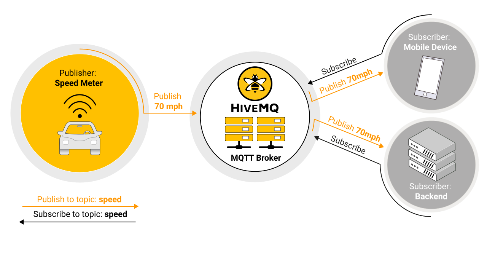
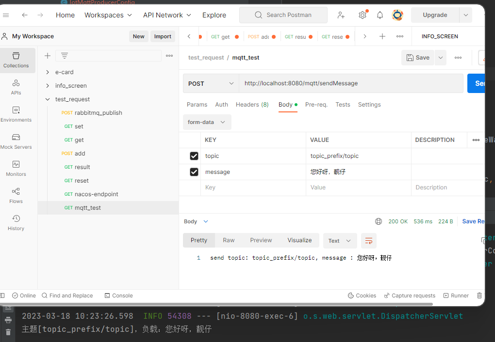

# Spring集成mqtt

<font size = 5 color = gray>mqtt参考：https://www.hivemq.com/blog/how-to-get-started-with-mqtt/</font><br><font size = 5 color = gray>Integration-mqtt参考：https://docs.spring.io/spring-integration/docs/5.5.16/reference/html/mqtt.html#mqtt</font>

>据我们了解，rabbitMq是一个消息队列中间件，是一个代理，支持多种协议包括默认的amqp、mqtt、http、websocket等。<br>其中mqtt是一种轻量级、高可用的可用于消息推送的协议，通信模式为发布订阅，常用于物联网场景。<br>Spring Integration支持集成mqtt，mqttv3是一个mqtt客户端用于连接mqtt服务器。

<h2>1、认识mqtt</h2>

>MQTT is a **publish/subscribe protocol** that is **lightweight** and requires a minimal footprint and bandwidth to connect an **IoT device**. Unlike HTTP’s request/response paradigm, MQTT is **event driven** and **enables messages to be pushed to clients**. This type of architecture decouples the clients from each other to enable a highly scalable solution **without dependencies between data producers and data consumers**.



<h3>1.1、Basic Concepts of MQTT</h3>

>At the core of MQTT is the MQTT broker and the MQTT clients. The broker is responsible for dispatching messages between the sender and the rightful receivers. <br>The MQTT broker uses the topics and the subscriber list to dispatch messages to appropriate clients.<br>To support reliable message delivery, the protocol supports 3 different types of quality of services messages: 0 - at most once, 1 - at least once, and 2 - exactly once.<br>

<h2>2、入门Spring Integration mqtt</h2>

>Spring Integration mqtt的Inbound和Outbound都依赖于mqtt客户端，此例子中使用的是mqttv3

<h3>2.1、仓库</h3>

>Spring Integration provides **inbound** **and** **outbound** **channel** **adapters** to support the Message Queueing Telemetry Transport (MQTT) protocol.

```xml
<dependency>
    <groupId>org.springframework.integration</groupId>
    <artifactId>spring-integration-mqtt</artifactId>
    <version>5.5.16</version>
</dependency>
```

<h3>2.2、Inbound (Message-driven) Channel Adapter</h3>

>The inbound channel adapter is implemented by the MqttPahoMessageDrivenChannelAdapter.

<h4>2.2.1、Xml Configuration</h4>

```xml
<!-- xml配置Inbound -->
<bean id="clientFactory"
        class="org.springframework.integration.mqtt.core.DefaultMqttPahoClientFactory">
    <property name="connectionOptions">
        <bean class="org.eclipse.paho.client.mqttv3.MqttConnectOptions">
            <property name="userName" value="${mqtt.username}"/>
            <property name="password" value="${mqtt.password}"/>
        </bean>
    </property>
</bean>

<int-mqtt:message-driven-channel-adapter id="oneTopicAdapter"
    client-id="foo"  
    url="tcp://localhost:1883"  
    topics="bar,baz"  
    qos="1,2"  
    converter="myConverter"  
    client-factory="clientFactory"  
    send-timeout="123"  
    error-channel="errors"  
    recovery-interval="10000"  
    manual-acks="false" 
    channel="out" />

```

<h4>2.2.2、Adding and Removing Topics at Runtime</h4>

```java
 adapter.addTopic();
 adapter.removeTopic();
```

<h4>2.2.3、Configuring with Java Configuration</h4>

```java
@SpringBootApplication
public class MqttJavaApplication {

    public static void main(String[] args) {
        new SpringApplicationBuilder(MqttJavaApplication.class)
                .web(false)
                .run(args);
    }

    @Bean
    public MqttPahoClientFactory mqttClientFactory() {
        DefaultMqttPahoClientFactory factory = new DefaultMqttPahoClientFactory();
        MqttConnectOptions options = new MqttConnectOptions();

        // mqtt用户名&密码
        String userName = "guest";
        String pwd = "guest";
        // mqtt服务地址，可以是多个
        options.setServerURIs(new String[]{"tcp://localhost:1883"});
        options.setUserName(userName);
        options.setPassword(pwd.toCharArray());
        factory.setConnectionOptions(options);

        return factory;
    }

    @Bean
    public MessageChannel mqttInputChannel() {
        return new DirectChannel();
    }

    @Bean
    public MessageProducer inbound() {
        // 订阅主题,保证唯一性
        String inClientId = UUID.randomUUID().toString().replaceAll("-", "");
        // 最后的#相当于通配符的概念
        String[] topic = {"topic_prefix/topic/#"};
        MqttPahoMessageDrivenChannelAdapter adapter = new MqttPahoMessageDrivenChannelAdapter(
                inClientId,
                mqttClientFactory(),
                topic);

        adapter.setCompletionTimeout(5000);

//        adapter.addTopic();
//        adapter.removeTopic();

        DefaultPahoMessageConverter defaultPahoMessageConverter = new DefaultPahoMessageConverter();
        // 按字节接收消息
//        defaultPahoMessageConverter.setPayloadAsBytes(true);
        adapter.setConverter(defaultPahoMessageConverter);
        // 设置QoS
        adapter.setQos(1);
        adapter.setOutputChannel(mqttInputChannel());

        return adapter;
    }

    @Bean
    @ServiceActivator(inputChannel = "mqttInputChannel")
    public MessageHandler handler() {
        return new MessageHandler() {

            @Override
            public void handleMessage(Message<?> message) throws MessagingException {
                System.out.println(message.getPayload());
            }

        };
    }

}
```

<h4>2.2.4、Configuring with the Java DSL</h4>

```java
@SpringBootApplication
public class MqttJavaApplication {

    public static void main(String[] args) {
        new SpringApplicationBuilder(MqttJavaApplication.class)
            .web(false)
            .run(args);
    }

    @Bean
    public IntegrationFlow mqttInbound() {
        return IntegrationFlows.from(
                         new MqttPahoMessageDrivenChannelAdapter("tcp://localhost:1883",
                                        "testClient", "topic1", "topic2");)
                .handle(m -> System.out.println(m.getPayload()))
                .get();
    }

}
```

<h3>2.3、Outbound Channel Adapter</h3>

>The outbound channel adapter is implemented by the MqttPahoMessageHandler, which is wrapped in a ConsumerEndpoint.

<h4>2.3.1、Xml Configuration</h4>

```java
<int-mqtt:outbound-channel-adapter id="withConverter"
    client-id="foo"  
    url="tcp://localhost:1883"  
    converter="myConverter"  
    client-factory="clientFactory"  
    default-qos="1"  
    qos-expression="" 
    default-retained="true"  
    retained-expression="" 
    default-topic="bar"  
    topic-expression="" 
    async="false"  
    async-events="false"  
    channel="target" />
```

<h4>2.3.2、Configuring with Java Configuration</h4>

```java
@SpringBootApplication
@IntegrationComponentScan
public class MqttJavaApplication {

    public static void main(String[] args) {
        ConfigurableApplicationContext context =
                new SpringApplicationBuilder(MqttJavaApplication.class)
                        .web(false)
                        .run(args);
        MyGateway gateway = context.getBean(MyGateway.class);
        gateway.sendToMqtt("foo");
    }

    @Bean
    public MqttPahoClientFactory mqttClientFactory() {
        DefaultMqttPahoClientFactory factory = new DefaultMqttPahoClientFactory();
        MqttConnectOptions options = new MqttConnectOptions();
        options.setServerURIs(new String[] { "tcp://host1:1883", "tcp://host2:1883" });
        options.setUserName("username");
        options.setPassword("password".toCharArray());
        factory.setConnectionOptions(options);
        return factory;
    }

    @Bean
    @ServiceActivator(inputChannel = "mqttOutboundChannel")
    public MessageHandler mqttOutbound() {
        MqttPahoMessageHandler messageHandler =
                       new MqttPahoMessageHandler("testClient", mqttClientFactory());
        messageHandler.setAsync(true);
        messageHandler.setDefaultTopic("testTopic");
        return messageHandler;
    }

    @Bean
    public MessageChannel mqttOutboundChannel() {
        return new DirectChannel();
    }

    @MessagingGateway(defaultRequestChannel = "mqttOutboundChannel")
    public interface MyGateway {

        void sendToMqtt(String data);

    }

}
```

<h4>2.3.3、Configuring with the Java DSL</h4>

```java
@SpringBootApplication
public class MqttJavaApplication {

    public static void main(String[] args) {
        new SpringApplicationBuilder(MqttJavaApplication.class)
            .web(false)
            .run(args);
    }

   	@Bean
   	public IntegrationFlow mqttOutboundFlow() {
   	    return f -> f.handle(new MqttPahoMessageHandler("tcp://host1:1883", "someMqttClient"));
    }

}
```

<h2>3、搭建IOT服务</h2>

<h3>3.1、mqtt代理服务器</h3>

<h3>3.2、引入依赖</h3>

```xml
        <dependency>
            <groupId>org.eclipse.paho</groupId>
            <artifactId>org.eclipse.paho.client.mqttv3</artifactId>
            <version>1.2.5</version>
        </dependency>
        <dependency>
            <groupId>org.springframework.integration</groupId>
            <artifactId>spring-integration-mqtt</artifactId>
            <version>5.5.12</version>
        </dependency>
```

<h3>3.3、配置Inbound/OutBound Bean(依赖于mqttv3客户端)</h3>

```java
package org.arvin.config;

import org.eclipse.paho.client.mqttv3.MqttConnectOptions;
import org.springframework.context.annotation.Bean;
import org.springframework.context.annotation.Configuration;
import org.springframework.integration.annotation.MessagingGateway;
import org.springframework.integration.annotation.ServiceActivator;
import org.springframework.integration.channel.DirectChannel;
import org.springframework.integration.core.MessageProducer;
import org.springframework.integration.mqtt.core.DefaultMqttPahoClientFactory;
import org.springframework.integration.mqtt.core.MqttPahoClientFactory;
import org.springframework.integration.mqtt.inbound.MqttPahoMessageDrivenChannelAdapter;
import org.springframework.integration.mqtt.outbound.MqttPahoMessageHandler;
import org.springframework.integration.mqtt.support.DefaultPahoMessageConverter;
import org.springframework.integration.mqtt.support.MqttHeaders;
import org.springframework.messaging.MessageChannel;
import org.springframework.messaging.MessageHandler;
import org.springframework.messaging.handler.annotation.Header;

import java.util.UUID;

@Configuration
public class IotMqttProducerConfig {

    @Bean
    public MqttPahoClientFactory mqttClientFactory() {
        DefaultMqttPahoClientFactory factory = new DefaultMqttPahoClientFactory();
        MqttConnectOptions options = new MqttConnectOptions();

        // mqtt用户名&密码
        String userName = "guest";
        String pwd = "guest";
        // mqtt服务地址，可以是多个
        options.setServerURIs(new String[]{"tcp://localhost:1883"});
        options.setUserName(userName);
        options.setPassword(pwd.toCharArray());
        factory.setConnectionOptions(options);

        return factory;
    }

    /**
     * 2、接收消息的通道
     */
    @Bean
    public MessageChannel mqttInputChannel() {
        return new DirectChannel();
    }

    /**
     * 接收消息
     *
     * @return
     */
    @Bean
    public MessageProducer inbound() {
        // 订阅主题,保证唯一性
        String inClientId = UUID.randomUUID().toString().replaceAll("-", "");
        // 最后的#相当于通配符的概念
        String[] topic = {"topic_prefix/topic/#"};
        MqttPahoMessageDrivenChannelAdapter adapter = new MqttPahoMessageDrivenChannelAdapter(
                inClientId,
                mqttClientFactory(),
                topic);

        adapter.setCompletionTimeout(5000);

//        adapter.addTopic();
//        adapter.removeTopic();

        DefaultPahoMessageConverter defaultPahoMessageConverter = new DefaultPahoMessageConverter();
        // 按字节接收消息
//        defaultPahoMessageConverter.setPayloadAsBytes(true);
        adapter.setConverter(defaultPahoMessageConverter);
        // 设置QoS
        adapter.setQos(1);
        adapter.setOutputChannel(mqttInputChannel());

        return adapter;
    }


    /**
     * 3、消息处理
     * ServiceActivator注解表明：当前方法用于处理MQTT消息，inputChannel参数指定了用于消费消息的channel
     */
    @Bean
    @ServiceActivator(inputChannel = "mqttInputChannel")
    public MessageHandler handler() {
        return message -> {
            String payload = message.getPayload().toString();

            // byte[] bytes = (byte[]) message.getPayload(); // 收到的消息是字节格式
            String topic = message.getHeaders().get("mqtt_receivedTopic").toString();
            // 可以根据topic进行处理不同的业务类型
            System.out.println("主题[" + topic + "]，负载：" + payload);
        };
    }

    /**
     * 发送消息的通道
     *
     * @return
     */
    @Bean
    public MessageChannel mqttOutboundChannel() {
        return new DirectChannel();
    }

    /**
     * 发送消息
     */
    @Bean
    @ServiceActivator(inputChannel = "mqttOutboundChannel")
    public MessageHandler outbound() {

        // 连接clientId保证唯一
        String outClientId = UUID.randomUUID().toString().replaceAll("-", "");

        // 发送消息和消费消息Channel可以使用相同MqttPahoClientFactory
        MqttPahoMessageHandler messageHandler = new MqttPahoMessageHandler(outClientId, mqttClientFactory());
        // 如果设置成true，即异步，发送消息时将不会阻塞。
        // messageHandler.setAsync(true);
        // 设置默认的topic
        // messageHandler.setDefaultTopic("defaultTopic");
        // 设置默认QoS
        messageHandler.setDefaultQos(1);

        // Paho消息转换器
        DefaultPahoMessageConverter defaultPahoMessageConverter = new DefaultPahoMessageConverter();

        // 发送默认按字节类型发送消息
        // defaultPahoMessageConverter.setPayloadAsBytes(true);
        messageHandler.setConverter(defaultPahoMessageConverter);
        return messageHandler;
    }

    @MessagingGateway(defaultRequestChannel = "mqttOutboundChannel")
    public interface MqttGateWay {

        /**
         * 发送消息
         *
         * @param payload 发送的消息
         */
        void sendToMqtt(String payload);

        /**
         * 指定topic消息发送
         *
         * @param topic   指定topic
         * @param payload 消息
         */
        void sendToMqtt(@Header(MqttHeaders.TOPIC) String topic, String payload);

        void sendToMqtt(@Header(MqttHeaders.TOPIC) String topic, @Header(MqttHeaders.QOS) int qos, String payload);

        void sendToMqtt(@Header(MqttHeaders.TOPIC) String topic, @Header(MqttHeaders.QOS) int qos, byte[] payload);
    }

}
```

```java
package org.arvin.controller;
import org.arvin.config.IotMqttProducerConfig;
import org.springframework.beans.factory.annotation.Autowired;
import org.springframework.web.bind.annotation.PostMapping;
import org.springframework.web.bind.annotation.RequestMapping;
import org.springframework.web.bind.annotation.RestController;

/**
 * 对外暴露发送消息的controller
 */
@RestController
@RequestMapping("/mqtt")
public class MqttController {

    @Autowired
    private IotMqttProducerConfig.MqttGateWay mqttGateWay;

    @PostMapping("/sendMessage")
    public String sendMessage(String topic, String message) {
        // 发送消息到指定topic
        mqttGateWay.sendToMqtt(topic, 1, message);
        return "send topic: " + topic + ", message : " + message;
    }
}
```
<h3>3.4、演示</h3>




