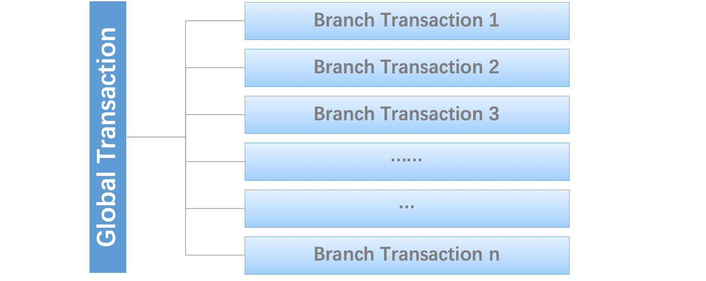

# 说说分布式事务（全局事务）-Seata

<font size = 5 color = gray>参考:https://github.com/seata/seata；<br>https://seata.io/zh-cn/docs/ops/deploy-guide-beginner.html</font>


>在传统的单体应用中，为保持数据一致性，由本地事务去保证事务一致。但随着业务量复杂，单体应用可能会面临着臃肿、难以维护、性能等问题，于是就出来了微服务。微服务，言简意赅来说就是把应用拆分成多个应用(微服务)，服务之间通过远程调用或者其他调用方式进行交互，这些服务可能不在同一服务器，那么此时本地事务便无法保证整个应用的数据一致性，也可以称之为全部微服务数据一致性吧。

<h2>1、什么是Seata？</h2>


>是分布式事务，由分支事务（通常为微服务本地事务）组成的全局事务。


>Seata分布式事务有三种角色：<br>**Transaction Coordinator(TC,事务调度器)：**维护全局事务和分支事务，驱动全局提交和回滚<br>**Transaction Manager(TM,事务管理器)：**定义全局事务的范围；开始全局事务，提交或回滚全局事务<br>**Resource Manager(RM,资源管理器)：**管理分支事务所在的资源，告诉事务调度器注册分支事务并上报分支事务的状态，并驱动分支事务提交和回滚



>典型的Seata管理分布式事务的生命周期：<br>1.TM通知TC开启新的全局事务，TC生成XID代表这个全局事务。<br>2.XID通过微服务调用链条传播。<br>3.RM注册本地事务作为XID全局事务的分支事务到TC.<br>4.TM通知TC提交或回滚XID全局事务。<br>5.TC驱动XID下的全部分支事务完成提交或者回滚。


<font size = 10 color = balck>依赖</font>

```xml
<seata.version>1.6.1</seata.version>
<dependency>
    <groupId>io.seata</groupId>
    <artifactId>seata-all</artifactId>
    <version>${seata.version}</version>
</dependency>

<!--If your project base on `Spring Boot`, you can directly use the following dependencies-->
<!--Notice: `seata-spring-boot-starter` has included `seata-all` dependency-->
<dependency>
    <groupId>io.seata</groupId>
    <artifactId>seata-spring-boot-starter</artifactId>
    <version>${seata.version}</version>
</dependency>

```

<h2>2、nacos 集成 Seata</h2>

>就根据以上的库存、订单、账户场景写一个例子。

>前置知识：<br>了解CS架构,无论nacos、redis、mysql，rabbit等都是cs架构；编写代码之前要先把软件相对应的服务器搭建起来<br>nacos用作服务发现注册中心、配置中心，seata服务端也注册在nacos中，也使用nacos作为配置中心；其实发现微服务可以是服务端也可以是客户端，呃呃我目前的理解。<br>远程调用rpc，要求微服务之间的rpc技术是一致的。

<h3>2.1、安装nacos</h3>

>参考地址：https://nacos.io/zh-cn/docs/what-is-nacos.html<br>下载版本：nacos-server-2.1.0<br>Windows启动:startup.cmd -m standalone<br>初始密码：nacos nacos

<h3>2.2、安装seata</h3>

>参考地址：https://seata.io/zh-cn/docs/ops/deploy-guide-beginner.html <br>下载版本：seata-server-1.4.2<br>此处演示seata注册到nacos并将nacos作为配置中心

<h4>2.1、修改服务端配置文件</h4>

<h5>2.1.1、修改conf文件夹下registry.conf和file.conf文件</h5>


<h5>2.1.2、导入script文件夹，并修改config.txt后运行脚本上传至nacos配置中心</h5>

>导入的script文件夹从github下载，注意版本要与seata服务端一致


<font size = 7 color = balck>下面要把config.txt中的文件导入都Nacos的配置中心里，需要进入到config-center目录下的nacos文件夹，里面有两个文件，一个是.sh文件，一个是.py文件，当然也就提供了两种方式导入Nacos配置中心。下面使用.sh文件，在nacos文件下打开git bash终端命令行，执行如下命令：</font>

>sh nacos-config.sh -h 127.0.0.1 -p 8848 -g SEATA_GROUP -t 88b8f583-43f9-4272-bd46-78a9f89c56e8 -u nacos -w nacos<br>-h：nacos地址<br>-p：端口，默认8848<br>-g：seata的服务列表分组名称<br>-t：nacos命名空间id<br>-u和-w：nacos的用户名和密码


<h4>2.1.2、初始化服务端mysql数据库，启动seata-serve</h4>

<font size = 7 color = balck>初始化数据库</font>


```sql

CREATE TABLE IF NOT EXISTS `global_table`
(
    `xid`                       VARCHAR(128) NOT NULL,
    `transaction_id`            BIGINT,
    `status`                    TINYINT      NOT NULL,
    `application_id`            VARCHAR(32),
    `transaction_service_group` VARCHAR(32),
    `transaction_name`          VARCHAR(128),
    `timeout`                   INT,
    `begin_time`                BIGINT,
    `application_data`          VARCHAR(2000),
    `gmt_create`                DATETIME,
    `gmt_modified`              DATETIME,
    PRIMARY KEY (`xid`),
    KEY `idx_gmt_modified_status` (`gmt_modified`, `status`),
    KEY `idx_transaction_id` (`transaction_id`)
) ENGINE = InnoDB
  DEFAULT CHARSET = utf8;

-- the table to store BranchSession data
CREATE TABLE IF NOT EXISTS `branch_table`
(
    `branch_id`         BIGINT       NOT NULL,
    `xid`               VARCHAR(128) NOT NULL,
    `transaction_id`    BIGINT,
    `resource_group_id` VARCHAR(32),
    `resource_id`       VARCHAR(256),
    `branch_type`       VARCHAR(8),
    `status`            TINYINT,
    `client_id`         VARCHAR(64),
    `application_data`  VARCHAR(2000),
    `gmt_create`        DATETIME(6),
    `gmt_modified`      DATETIME(6),
    PRIMARY KEY (`branch_id`),
    KEY `idx_xid` (`xid`)
) ENGINE = InnoDB
  DEFAULT CHARSET = utf8;

-- the table to store lock data
CREATE TABLE IF NOT EXISTS `lock_table`
(
    `row_key`        VARCHAR(128) NOT NULL,
    `xid`            VARCHAR(128),
    `transaction_id` BIGINT,
    `branch_id`      BIGINT       NOT NULL,
    `resource_id`    VARCHAR(256),
    `table_name`     VARCHAR(32),
    `pk`             VARCHAR(36),
    `gmt_create`     DATETIME,
    `gmt_modified`   DATETIME,
    PRIMARY KEY (`row_key`),
    KEY `idx_branch_id` (`branch_id`)
) ENGINE = InnoDB
  DEFAULT CHARSET = utf8;

CREATE TABLE IF NOT EXISTS `distributed_lock`
(
    `lock_key`       CHAR(20) NOT NULL,
    `lock_value`     VARCHAR(20) NOT NULL,
    `expire`         BIGINT,
    primary key (`lock_key`)
) ENGINE = InnoDB
  DEFAULT CHARSET = utf8mb4;

INSERT INTO `distributed_lock` (lock_key, lock_value, expire) VALUES ('AsyncCommitting', ' ', 0);
INSERT INTO `distributed_lock` (lock_key, lock_value, expire) VALUES ('RetryCommitting', ' ', 0);
INSERT INTO `distributed_lock` (lock_key, lock_value, expire) VALUES ('RetryRollbacking', ' ', 0);
INSERT INTO `distributed_lock` (lock_key, lock_value, expire) VALUES ('TxTimeoutCheck', ' ', 0);

```

<font size = 7 color = balck>启动seata-server</font>


<h3>2.3、准备应用的公共模块</h3>

>以下贴出demo地址，这里不展开

<h3>2.4、微服务开发-注册、配置、远程调用、开启分布式事务</h3>

>此处主要看seata相关的代码

```xml
        <dependency>
            <groupId>com.alibaba.cloud</groupId>
            <artifactId>spring-cloud-starter-alibaba-seata</artifactId>
            <exclusions>
                <exclusion>
                    <groupId>io.seata</groupId>
                    <artifactId>seata-spring-boot-starter</artifactId>
                </exclusion>
            </exclusions>
        </dependency>
        <dependency>
            <groupId>io.seata</groupId>
            <artifactId>seata-spring-boot-starter</artifactId>
            <version>1.4.2</version>
        </dependency>
```

```properties

#详情看seata官方文档
seata.enabled=true
seata.enable-auto-data-source-proxy=true

seata.tx-service-group=scorpios_tx_group
seata.registry.type=nacos

seata.registry.nacos.application=seata-server
seata.registry.nacos.server-addr=localhost:8848
seata.registry.nacos.username=nacos
seata.registry.nacos.password=nacos
seata.registry.nacos.namespace=94fd5459-3bc5-4c97-9493-89bab3001886
seata.registry.nacos.cluster=default
seata.registry.nacos.group=SEATA_GROUP

seata.config.type=nacos
seata.config.nacos.server-addr=localhost:8848
seata.config.nacos.namespace=94fd5459-3bc5-4c97-9493-89bab3001886
seata.config.nacos.group=SEATA_GROUP
seata.config.nacos.username=nacos
seata.config.nacos.password=nacos
```

```java
package org.arvin;

import io.seata.spring.annotation.datasource.EnableAutoDataSourceProxy;
import org.mybatis.spring.annotation.MapperScan;
import org.springframework.boot.SpringApplication;
import org.springframework.boot.autoconfigure.SpringBootApplication;
import org.springframework.cloud.client.discovery.EnableDiscoveryClient;
import org.springframework.cloud.openfeign.EnableFeignClients;

/**
 * Hello world!
 *
 */
@SpringBootApplication
@EnableDiscoveryClient
@MapperScan("org.arvin.mapper")
@EnableAutoDataSourceProxy    // 开启seata
@EnableFeignClients(basePackages = "org.arvin.service.openfeign")
public class OrderService
{
    public static void main( String[] args )
    {
        SpringApplication.run(OrderService.class,args);
    }
}

```

```java
package org.arvin.controller;

import io.seata.spring.annotation.GlobalTransactional;
import org.arvin.api.CommonResult;
import org.arvin.pojo.TAccount;
import org.arvin.pojo.TOrder;
import org.arvin.pojo.TStorage;
import org.arvin.service.ITOrderService;
import org.arvin.service.openfeign.AccountOpenFeign;
import org.arvin.service.openfeign.StorageOpenFeign;
import org.springframework.beans.factory.annotation.Autowired;
import org.springframework.stereotype.Controller;
import org.springframework.web.bind.annotation.GetMapping;
import org.springframework.web.bind.annotation.PathVariable;
import org.springframework.web.bind.annotation.PostMapping;
import org.springframework.web.bind.annotation.RequestMapping;

/**
 * <p>
 *  前端控制器
 * </p>
 *
 * @author arvin
 * @since 2023-03-21
 */
@Controller
@RequestMapping("/tOrder")
public class TOrderController {

    @Autowired
    ITOrderService orderService;

    @Autowired
    AccountOpenFeign accountOpenFeign;

    @Autowired
    StorageOpenFeign storageOpenFeign;

    @PostMapping("")
    public CommonResult<TOrder> put(TOrder order){
        orderService.save(order);
        return CommonResult.success(order);
    }

    @GetMapping("/test/feign/{accountId}/{storageId}")
    public void feignTest(@PathVariable("accountId")long accountId,@PathVariable("storageId")long storageId){
        CommonResult<TAccount> accountCommonResult = accountOpenFeign.getAccountById(accountId);
        CommonResult<TStorage> storageCommonResult = storageOpenFeign.getStorageById(storageId);

        System.out.println(accountCommonResult);
        System.out.println(storageCommonResult);
    }

    @GlobalTransactional(name = "scorpios-create-order",rollbackFor = Exception.class)
    @GetMapping("/business/{accountId}/{storageId}/{count}/{money}")
    public void business(@PathVariable("accountId")int accountId,@PathVariable("storageId")int storageId,@PathVariable("count")int count,
                          @PathVariable("money")int money){
        System.out.println("先生成订单");
        TOrder order = new TOrder();
        order.setId(2);
        order.setUserId(1);
        order.setProductId(1);
        order.setCount(count);
        order.setMoney(money);
        order.setStatus((byte) 0);

        orderService.save(order);

        System.out.println("减库存");
        storageOpenFeign.decrease(storageId,count);

        System.out.println("口余额");
        accountOpenFeign.decrease(accountId,money);

        System.out.println("修改订单状态，订单交易完毕");
        order.setStatus((byte) 1);
        orderService.updateById(order);
    }
}

```

<h3>2.5、演示与对比</h3>

>略